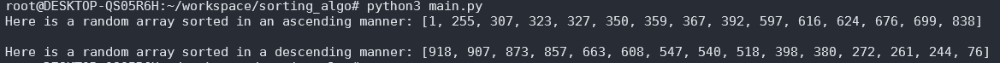

# `sorting_algo`

this is my first and simple sorting algorithm that can do both ascending and descending sorting.

---

## `table of contents`
- [`how it works`]()
- [`time complexity`]()
- [`license`]()